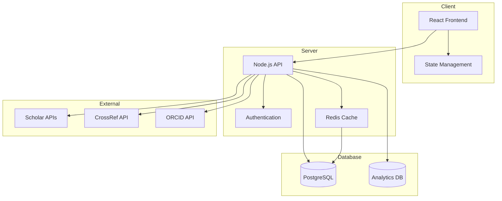

# System Architecture

## Overview
The Scholar Performance Tracker uses a modern microservices architecture with a clear separation between frontend and backend services.

## Components
1. Frontend (Next.js)
   - Server-side rendered React components
   - Tailwind CSS for styling
   - Recharts for data visualization

2. Backend (Express)
   - RESTful API endpoints
   - Authentication middleware
   - Data validation
   - Caching layer

3. Database
   - PostgreSQL for persistent storage
   - Redis for caching

## System Diagram

Data Flow

Client requests scholar data
Request passes through authentication
Data is retrieved from cache if available
If not in cache, data is fetched from database
Response is sent back to client
